# Project Guidance: Arabic Sentiment Analysis & Scraping Dashboard

This document provides a clean overview of the system workflows, extension capabilities, and data analysis procedures.

---

## 🛠 Operation Workflows (Extension)

The system is designed with modular actions that can be combined for a full data flow.

### 1. Basic Post Fetching
*   **Goal:** Get the primary posts from a profile.
*   **Action:** Click the **“Fetch Posts”** button.

### 2. Deep Comment Analysis
*   **Goal:** Retrieve full comment data and identify verified users.
*   **Pre-requisite:** Fetch Posts.
*   **Action:** Click **“Scrape All Comments”**.
*   **Visual:**
    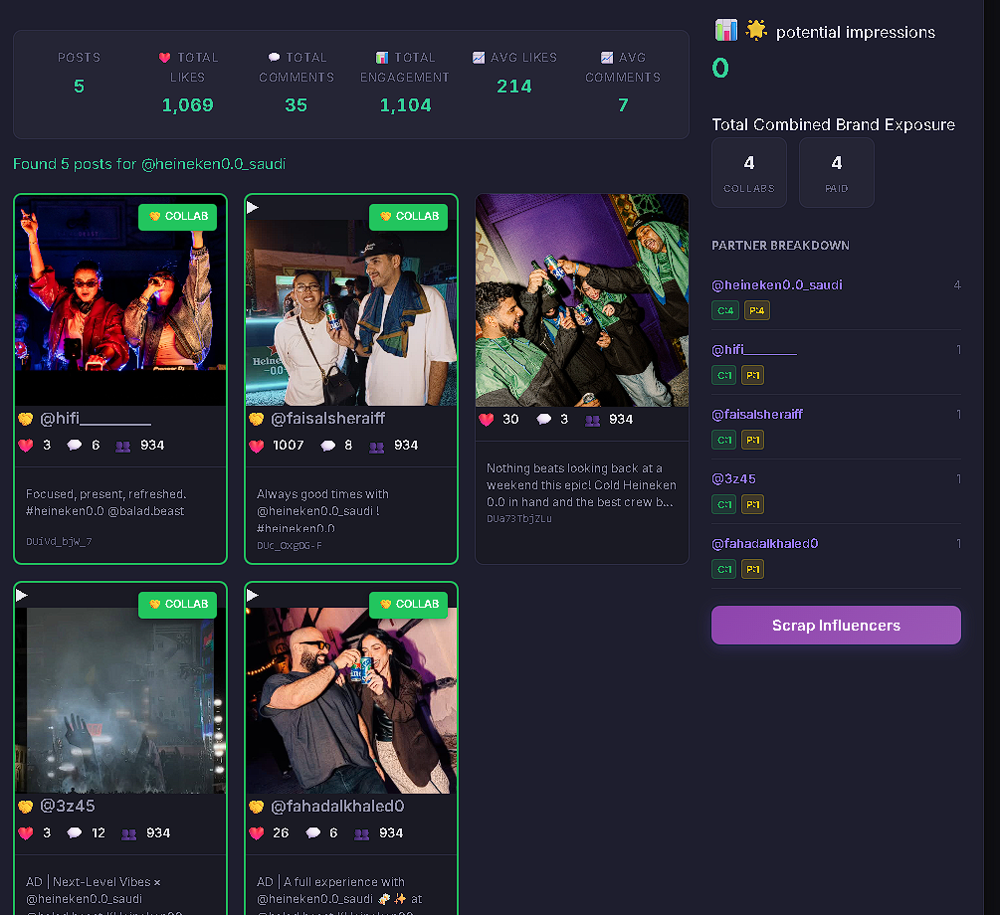

### 3. Influencer Scraper & Reach Discovery
*   **Goal:** Scrape collaboration profiles and calculate potential impressions.
*   **Pre-requisite:** Fetch Posts.
*   **Action:** Click **“Scrap Influencers”**.
*   **Behavior:** When you click this, the "Potential Impressions" counter fills up in real-time.
*   **Visual:**
    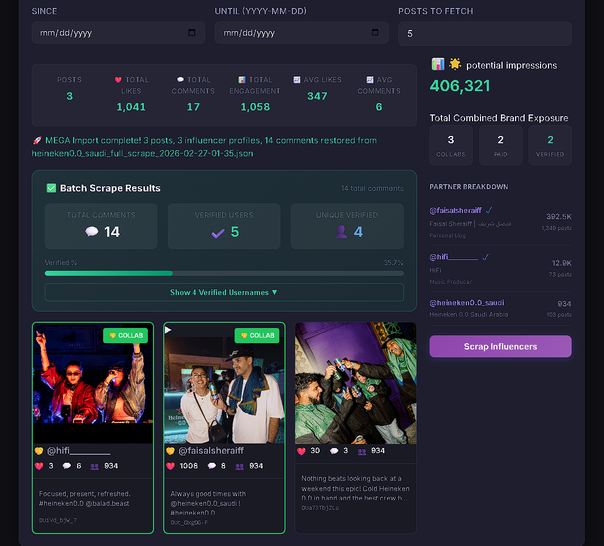

### 4. Post Filtering & Categorization
*   **Goal:** Identify paid vs. collaboration content.
*   **Action:** Use the filter toggles to isolate **Paid** or **Collab** posts.
*   **Visual:**
    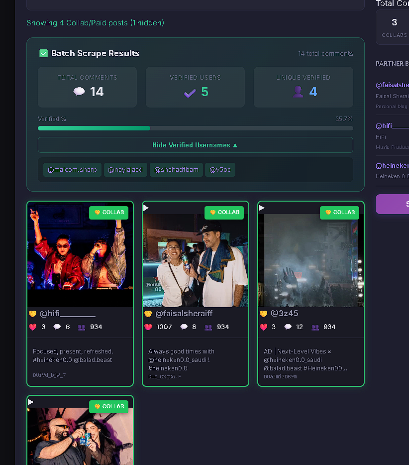

### 5. Full Data Export (The "MEGA" Flow)
*   **Goal:** Get a consolidated JSON of everything (Profile + Posts + Comments + Influencers).
*   **Action Flow:** 
    1. Fetch Posts
    2. Scrap Influencers
    3. (Optional) Scrape All Comments
    4. Click **“🚀 MEGA Export”**

---

## 📊 Sentiment Analysis Dashboard

Once data is exported via the extension, it can be uploaded here for deep insights.

### Analyzing a Dataset
1. **Upload:** Select your raw or processed JSON/XLSX file.
2. **Configure:** Identify the 'Comment' and 'Verified' fields for mapping.
   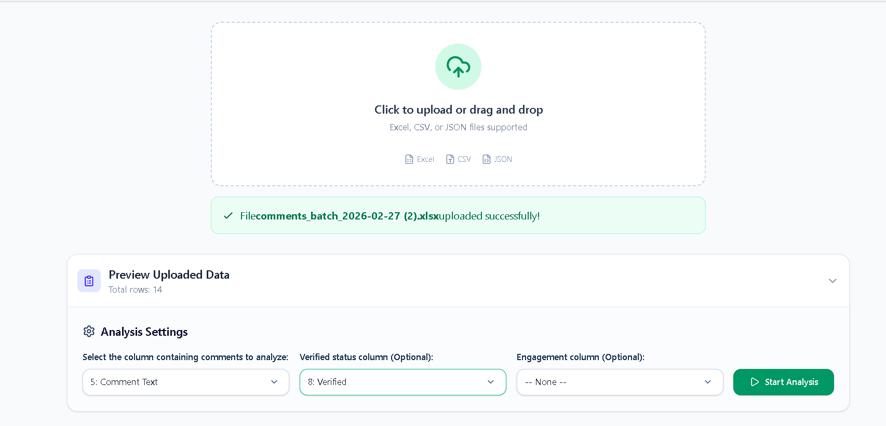
3. **Analyze:** Start the process to generate the dashboard.

### Key Visualizations & Features

#### 📈 Reach & Impressions
View the total calculated potential impressions based on the reach of commenters and influencers.
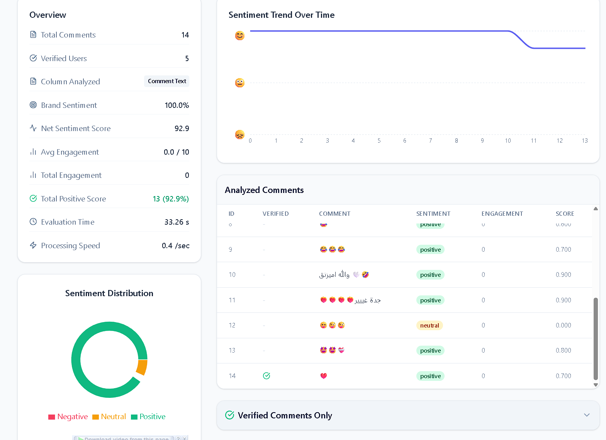

#### 🚫 Hate Comment Detection
The system automatically flags and samples comments containing toxic or negative sentiment.

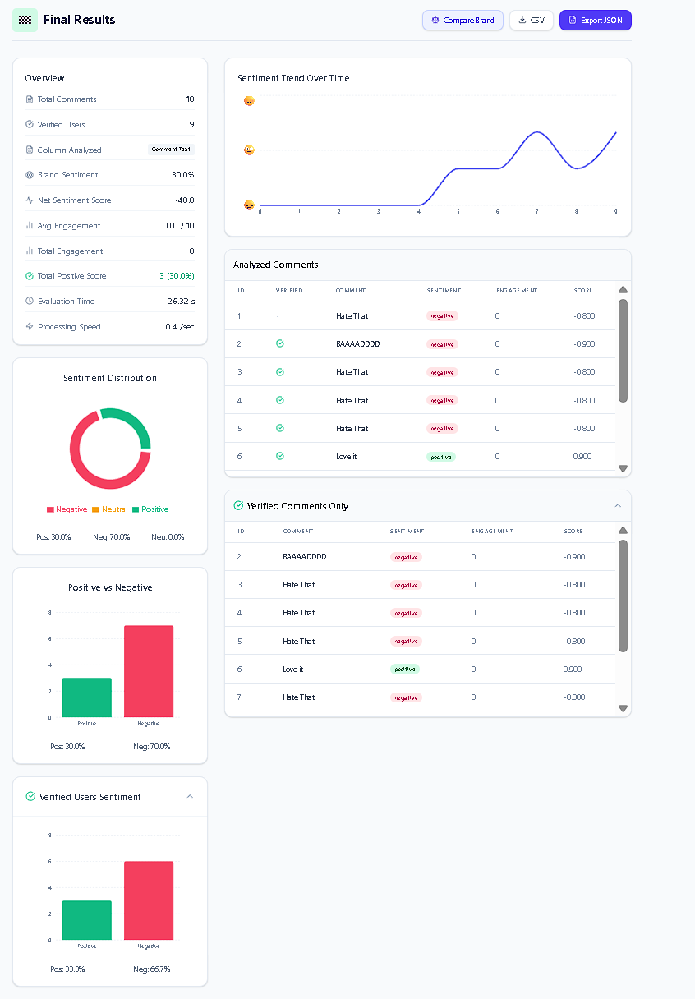

#### ✅ Verified User Analysis
Isolate the sentiment of verified accounts to see how market leaders and influencers perceive the brand.
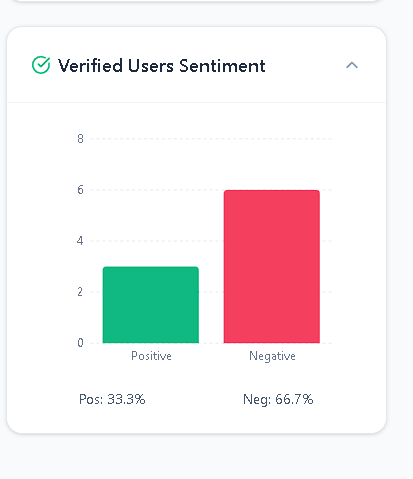

#### 🌓 Sentiment Volatility
Breakdown of positive vs. negative comments as a whole, showing the overall brand health.
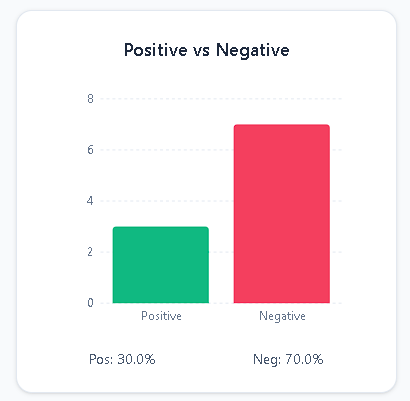

#### 📊 Sentiment Distribution
A granular view of sentiment trends across the entire dataset.
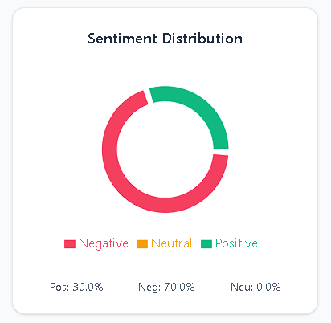

#### 📤 Exporting Results
Once analyzed, you can export the processed sentiment data for reporting.
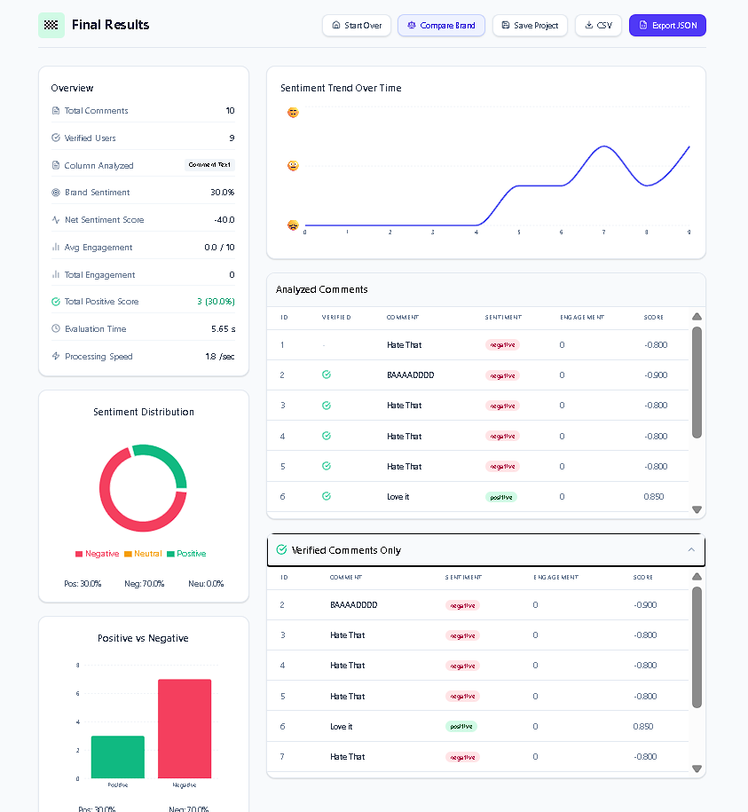

#### 🆚 Brand Comparison
Load multiple brand datasets to compare performance, sentiment scores, and engagement metrics side-by-side.
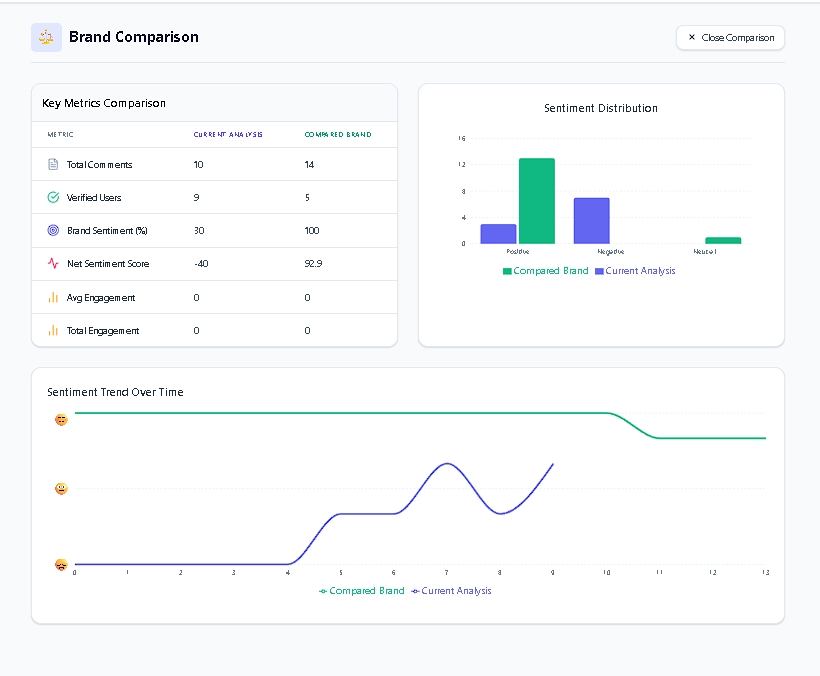

---

## 🎤 What to Say: Key Functions Rundown

*Use these points to explain the project's unique value proposition:*

*   **Integrated Workflow:** "We've built a seamless bridge between scraping and analysis. You can go from raw Instagram data to a full sentiment report in minutes."
*   **The MEGA Export:** "Instead of managing multiple files, our 'MEGA' feature bundles posts, influencer profiles, and comments into a single structured source of truth."
*   **Influencer Reach Metrics:** "We don't just count comments; we scrape the profiles of everyone interacting with the brand to calculate 'Potential Impressions'—showing the true scale of the conversation."
*   **Verified Commenter Tracking:** "A key highlight is our ability to isolate 'Verified' users. We show you exactly what the most influential voices are saying, which is often more critical than raw volume."
*   **Sophisticated Sentiment Engine:** "Our engine handles Arabic nuances, categorizing sentiment distribution and specifically flagging 'Hate Comments' to help brands manage their online reputation."
*   **Dataset Versatility:** "The dashboard is flexible—you can upload raw scraped data or pre-processed files, and it handles mapping fields dynamically."
*   **Competitive Benchmarking:** "We can compare different brands or campaigns side-by-side to see who is winning the sentiment war."

---

## 📂 Reference Test Data
*   **3 Posts Sample (Heineken):** [heineken_3Posts_MegaScrape.json](Test_Data/heineken_3Posts_MegaScrape.json)
*   **5 Posts Sample (Heineken):** [heineken_5Posts_MegaScrape.json](Test_Data/heineken_5Posts_MegaScrape.json)
*   **Hate Comments Sample:** [HateComments_Analysis.json](Test_Data/HateComments_Analysis.json)
*   **Good Comments Sample:** [GoodComments_Analysis.json](Test_Data/GoodComments_Analysis.json)
